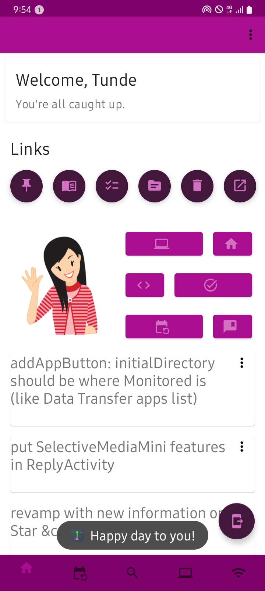
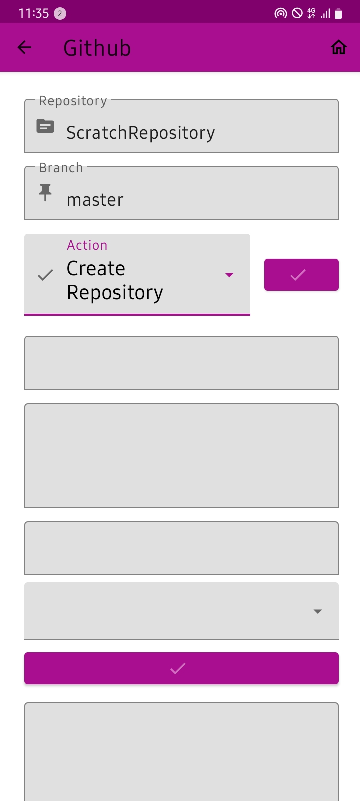
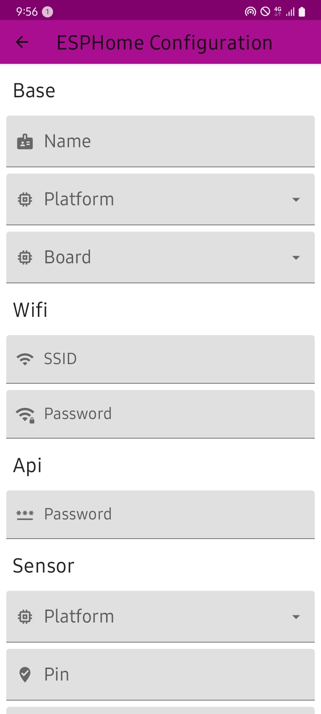
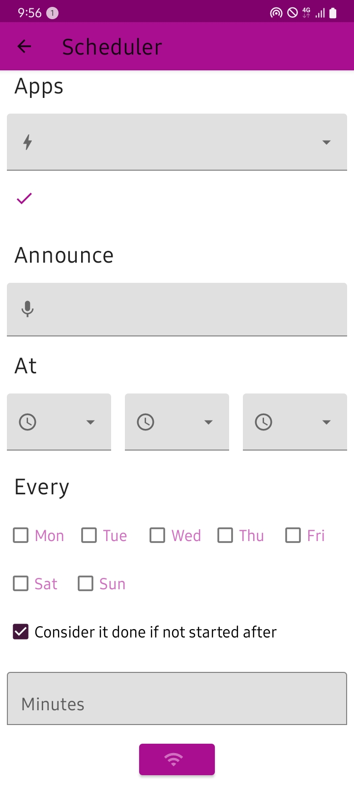
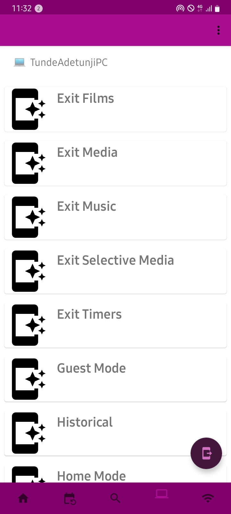

# Remote Linq
Remote interactivity with your PCs

 
 

## How it works:
Desktop Client (.NET) constantly checks Web Server (.NET) for commands meant for this computer (if the name maches). It can also send command to another PC, group of PCs or Android Client.

Web Server (.NET) listens for commands. If a command comes in, it stores it (SQL). Command can come from Desktop Client or Android Client.

Android Client sends command meant for a particular PC or group of PCs. It can also check Web Server for any command meant for it.

The setup can do these, and more:

When you long-tap the image on the home screen, it DISCREETLY starts sending your current location updates to your server (or all target PCs) at home.

With your GitHub account, you can create/read repos, and more.

For ESP Home services, if installed, the app can create config file and place it wherever you want on your server system.

You can initiate a task schedule on your ocmputer. Say, run a script file on Mondays at 9.00 AM.

You can send commands to your PC.

